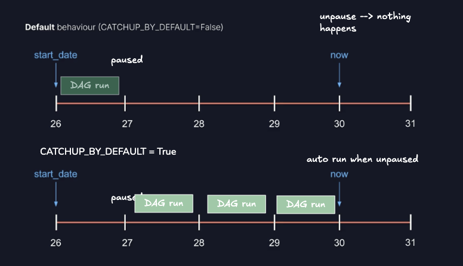

Overview
========

Welcome to Astronomer! This project was generated after you ran 'astro dev init' using the Astronomer CLI. This readme describes the contents of the project, as well as how to run Apache Airflow on your local machine.

Project Contents
================

Your Astro project contains the following files and folders:

- dags: This folder contains the Python files for your Airflow DAGs. By default, this directory includes one example DAG:
    - `example_astronauts`: This DAG shows a simple ETL pipeline example that queries the list of astronauts currently in space from the Open Notify API and prints a statement for each astronaut. The DAG uses the TaskFlow API to define tasks in Python, and dynamic task mapping to dynamically print a statement for each astronaut. For more on how this DAG works, see our [Getting started tutorial](https://www.astronomer.io/docs/learn/get-started-with-airflow).
- Dockerfile: This file contains a versioned Astro Runtime Docker image that provides a differentiated Airflow experience. If you want to execute other commands or overrides at runtime, specify them here.
- include: This folder contains any additional files that you want to include as part of your project. It is empty by default.
- packages.txt: Install OS-level packages needed for your project by adding them to this file. It is empty by default.
- requirements.txt: Install Python packages needed for your project by adding them to this file. It is empty by default.
- plugins: Add custom or community plugins for your project to this file. It is empty by default.
- airflow_settings.yaml: Use this local-only file to specify Airflow Connections, Variables, and Pools instead of entering them in the Airflow UI as you develop DAGs in this project.

Deploy Your Project Locally
===========================

Start Airflow on your local machine by running 'astro dev start'.

This command will spin up five Docker containers on your machine, each for a different Airflow component:

- Postgres: Airflow's Metadata Database
- Scheduler: The Airflow component responsible for monitoring and triggering tasks
- DAG Processor: The Airflow component responsible for parsing DAGs
- API Server: The Airflow component responsible for serving the Airflow UI and API
- Triggerer: The Airflow component responsible for triggering deferred tasks

When all five containers are ready the command will open the browser to the Airflow UI at http://localhost:8080/. You should also be able to access your Postgres Database at 'localhost:5432/postgres' with username 'postgres' and password 'postgres'.

Note: If you already have either of the above ports allocated, you can either [stop your existing Docker containers or change the port](https://www.astronomer.io/docs/astro/cli/troubleshoot-locally#ports-are-not-available-for-my-local-airflow-webserver).

Deploy Your Project to Astronomer
=================================

If you have an Astronomer account, pushing code to a Deployment on Astronomer is simple. For deploying instructions, refer to Astronomer documentation: https://www.astronomer.io/docs/astro/deploy-code/

Contact
=======

The Astronomer CLI is maintained with love by the Astronomer team. To report a bug or suggest a change, reach out to our support.

## Study notes
### Infra


### States of DAG run

1. Queue
2. Running (when first task runs)
3. Success / Failure

State of DAG run = state of the last task in the DAG

### Start date vs end date vs logical date

If a DAG is triggered on 2025-06-06, then Logical Date = 2025-06-05 (D-1)


### @dag parameters
```python
@dag(
    # must be unique across the project
    dag_id="check_dag", 
    
    # this is "optional" but if it's null it's only ok if the schedule is also null
    # start_date = DAG's first interval, will determine the timestamp Scheduler attempts to backfill
    # start_date vs end_date vs logical_date: something related to Airflow 2.x vs 3.x
    # the 3.x default behavior is more intuitive (CREATE_CRON_DATA_INTERVALS=False)
    start_date=datetime(2025,1,1), 

    # determines how often the DAG runs
    schedule="0 0 * * *",

    # catchup allows you to run non-triggered DAG, False by default
    catchup=False,

    # backfill allows running the DAG  on certain date range
    backfill

    # description
    description="DAG to check data"
)
```
### schedule


### catchup


### backfill
```python
airflow dags backfill --start-date START_DATE --end-date END_DATE dag_id
```

### XCOMs
